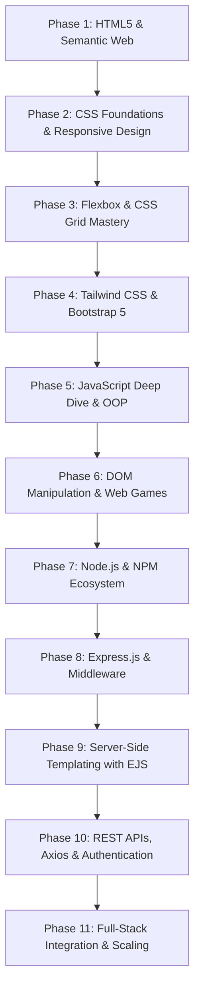

# 🌐 Full-Stack Web Development Journey

[](https://github.com/vikalp1817243/WebDevJourney)
[](https://github.com/vikalp1817243/WebDevJourney)
[](https://github.com/vikalp1817243/WebDevJourney)

Welcome to my **Web Development Journey** repository! This repository serves as a structured, daily progress log and project archive documenting my path in modern web development starting from **May 8, 2026**.

Each directory represents dedicated daily hands-on practice, concept deep dives, interactive mini-projects, or production-grade applications covering everything from semantic markup and responsive CSS architectures to backend APIs, authentication, and full-stack integration.

---

## 📑 Table of Contents

- [🚀 Tech Stack & Core Competencies](#-tech-stack--core-competencies)
- [🗺️ Journey Roadmap & Learning Phases](#️-journey-roadmap--learning-phases)
  - [Phase 1: HTML5 Foundations & Semantic Web](#phase-1-html5-foundations--semantic-web-days-12)
  - [Phase 2: Modern CSS, Positioning & Responsive Design](#phase-2-modern-css-positioning--responsive-design-days-310)
  - [Phase 3: Advanced Layouts — Flexbox & CSS Grid](#phase-3-advanced-layouts--flexbox--css-grid-days-1120)
  - [Phase 4: CSS Frameworks & Modern UI Systems](#phase-4-css-frameworks--modern-ui-systems-days-2126)
  - [Phase 5: JavaScript Core, OOP & Asynchronous Programming](#phase-5-javascript-core-oop--asynchronous-programming-days-2728-36)
  - [Phase 6: DOM Manipulation, Web APIs & Interactive Games](#phase-6-dom-manipulation-web-apis--interactive-games-days-2935-3738)
  - [Phase 7: Backend Foundations, Node.js & NPM Ecosystem](#phase-7-backend-foundations-nodejs--npm-ecosystem-days-3942)
  - [Phase 8: Express.js Architecture & Middleware Engineering](#phase-8-expressjs-architecture--middleware-engineering-days-4346)
  - [Phase 9: Server-Side Rendering (SSR) with EJS](#phase-9-server-side-rendering-ssr-with-ejs-days-4751)
  - [Phase 10: RESTful APIs, Axios & Authentication](#phase-10-restful-apis-axios--authentication-days-5257)
- [📂 Comprehensive Day-by-Day Directory Map](#-comprehensive-day-by-day-directory-map)
- [⭐ Flagship Projects Showcase](#-flagship-projects-showcase)
- [💻 Getting Started & Local Setup](#-getting-started--local-setup)
- [👤 Author & Connect](#-author--connect)

---

## 🚀 Tech Stack & Core Competencies

| Domain | Technologies & Tools |
|---|---|
| **Frontend** | HTML5, Semantic Elements, CSS3, Flexbox, CSS Grid, Responsive Design, Tailwind CSS, Bootstrap 5, Vanilla JavaScript (ES6+), jQuery, DOM APIs |
| **Backend & Runtime** | Node.js, Express.js, EJS (Embedded JavaScript), RESTful API Design, Middleware Engineering |
| **Networking & APIs** | Axios, Fetch API, HTTP Verbs (GET, POST, PUT, PATCH, DELETE), JSON Parsing, API Authentication (Basic, API Keys, Bearer Tokens, OAuth 2.0) |
| **Tooling & Workflow** | Git, GitHub, NPM, Postman, Particles.js, Inquirer.js, QR-Image |

---

## 🗺️ Journey Roadmap & Learning Phases



---

### Phase 1: HTML5 Foundations & Semantic Web (Days 1–2)
- Structural HTML syntax, headings, paragraphs, lists, links, and forms.
- Media elements, image optimization, and semantic attributes.
- Document structuring adhering to modern accessibility and SEO standards.

### Phase 2: Modern CSS, Positioning & Responsive Design (Days 3–10)
- CSS inclusion models (Inline, Internal, External) and separation of concerns.
- Selectors hierarchy, cascade rules, specificity calculations, and inheritance.
- Box model, margin collapsing, padding, borders, and dimensions.
- Positioning schemes: `static`, `relative`, `absolute`, `fixed`, and `sticky` with `z-index` layering.
- Display mechanics (`block`, `inline`, `inline-block`, `float`) and responsive media queries (`@media`).

### Phase 3: Advanced Layouts — Flexbox & CSS Grid (Days 11–20)
- **Flexbox (1D Layouts)**: Flex containers, main/cross axes, alignment (`justify-content`, `align-items`, `align-content`), wrapping, and sizing (`flex-grow`, `flex-shrink`, `flex-basis`).
- **CSS Grid (2D Layouts)**: Grid columns and rows, fractional units (`fr`), `minmax()`, implicit vs. explicit grids, template areas, and alignment.
- **Projects**: Responsive Pricing Matrix, Chess Board Grid, and Piet Mondrian Masterpiece reproduction.

### Phase 4: CSS Frameworks & Modern UI Systems (Days 21–26)
- **Tailwind CSS**: Utility-first CSS workflow, JIT engine configuration, custom utility compositions, and modern photo gallery.
- **Bootstrap 5**: Grid system, container breakpoints, utility classes, components (Cards, Navbars, Hero sections, Badges, Accordions), and Dark Mode theming.
- **Projects**: TinDog startup landing page, modern authentication interfaces, and developer portfolio base.

### Phase 5: JavaScript Core, OOP & Asynchronous Programming (Days 27–28, 36)
- **Comprehensive 17-part reference manual**: Primitives, type coercion, operators, control flow, functions, array methods (`map`, `filter`, `reduce`), and object manipulation.
- ES6+ features: Destructuring, spread/rest syntax, template literals, default parameters, and modules (`import`/`export`).
- Asynchronous fundamentals: Event loop, callbacks, Promises, and `async`/`await`.
- **Object-Oriented Programming (OOP)**: Constructor functions, prototype chaining, ES6 classes, inheritance, encapsulation, and method overriding.

### Phase 6: DOM Manipulation, Web APIs & Interactive Games (Days 29–35, 37–38)
- DOM tree traversal, element selection (`querySelector`, `getElementById`), and live vs. static node lists.
- Dynamic DOM mutation: Element creation, attribute manipulation, CSS class toggling, and style updates.
- Event listeners, event bubbling, event delegation, and keyboard/mouse input handling.
- **Interactive Projects**:
  - **Dicee**: 2-player random roll generator and live winner detection.
  - **Drum Kit**: Virtual drum instrument featuring keyboard key bindings, mouse triggers, sound synthesis, and button animations.
  - **jQuery**: Core selectors, DOM manipulation, animations, and event handling.
  - **Simon Game**: Classic memory sequencing game with pattern generation, user sequence validation, dynamic difficulty levels, sound feedback, and game-over states.

### Phase 7: Backend Foundations, Node.js & NPM Ecosystem (Days 39–42)
- Server-side architecture, event-driven runtime, and Node REPL.
- Built-in modules: File System (`fs`), Path (`path`), and OS (`os`).
- NPM ecosystem, package initialization, version management (`semantic versioning`), and dependency locking.
- **Project**: QR Code Generator CLI tool leveraging `inquirer` for interactive terminal prompts and `qr-image` for generating downloadable vector/PNG QR codes.

### Phase 8: Express.js Architecture & Middleware Engineering (Days 43–46)
- Express application lifecycle, port binding, and route handling.
- HTTP Request Methods (GET, POST, PUT, PATCH, DELETE) and status code protocols.
- API testing and endpoint debugging with Postman.
- **Middleware Mechanics**: Application-level middleware, built-in body parsers (`express.urlencoded`, `express.json`), custom request logging, and authorization guards.
- **Projects**: Band Name Generator & Secrets Security Portal.

### Phase 9: Server-Side Rendering (SSR) with EJS (Days 47–51)
- Templating engines overview, EJS tag taxonomy (`<%= %>`, `<%- %>`, `<%# %>`, `<% %>`).
- Dynamic data passing from Express controllers into rendered views.
- Modular architecture with EJS Partials (`header.ejs`, `footer.ejs`, navigation bars) and static asset hosting.
- **Project**: Dynamic multi-page web application with live data rendering.

### Phase 10: RESTful APIs, Axios & Authentication (Days 52–57)
- API architectural principles, endpoint design, URL queries, and route parameters.
- JSON structure, parsing, schema traversal, and dynamic template integration.
- Server-to-server HTTP requests using the **Axios** library.
- **Security & Authentication Patterns**:
  - No Authentication & Public APIs
  - Basic Authentication (Base64 encoding)
  - API Key Header & Query Authentication
  - Bearer Token Authentication
  - OAuth 2.0 Token Exchange Flows
- **Project**: Secrets REST API Client featuring complete CRUD operations (GET all secrets, POST new entries, PUT full replacement, PATCH partial updates, and DELETE removal).

---

## 📂 Comprehensive Day-by-Day Directory Map

| Directory | Topic / Focus | Key Concepts & Deliverables |
|---|---|---|
| [`Day1`](file:///home/jay/Documents/WebDev/Day1) | HTML Basics | Google Intro, Mozilla reference page, semantic text formatting |
| [`Day2`](file:///home/jay/Documents/WebDev/Day2) | HTML Attributes & Media | Image addition, attribute syntax, hyperlink architectures |
| [`Day3`](file:///home/jay/Documents/WebDev/Day3) | CSS Foundations | Inline, internal, and external styling paradigms |
| [`Day4`](file:///home/jay/Documents/WebDev/Day4) | CSS Selectors | Element, class, ID, and attribute selectors |
| [`Day5-Project01-forensics-hub`](file:///home/jay/Documents/WebDev/Day5-Project01-forensics-hub) | **Project 01: Forensics Hub** | Multi-page security SOPs, WCAG contrast standards, tabnabbing protection |
| [`Day6-Project02-Wazuh-SIEM-Alert-Dashboard-UI`](file:///home/jay/Documents/WebDev/Day6-Project02-Wazuh-SIEM-Alert-Dashboard-UI) | **Project 02: Wazuh Dashboard** | SIEM alert dashboard UI, status monitors, custom styling |
| [`Day7`](file:///home/jay/Documents/WebDev/Day7) | CSS Cascade & Specificity | Inheritance calculation, rule priority, `!important` implications |
| [`Day8`](file:///home/jay/Documents/WebDev/Day8) | CSS Positioning & Z-Index | Relative, absolute, fixed, and sticky positioning with z-index stacking |
| [`Day9`](file:///home/jay/Documents/WebDev/Day9) | Display & Floats | Block vs. Inline vs. Inline-block, clearing floats, layouts |
| [`Day10`](file:///home/jay/Documents/WebDev/Day10) | Responsive Design | CSS Media Queries (`@media`), breakpoints, viewport meta tag |
| [`Day11`](file:///home/jay/Documents/WebDev/Day11) | Multi-Page Responsive UI | Responsive portfolio scaffold and developer showcase |
| [`Day12`](file:///home/jay/Documents/WebDev/Day12) | Flexbox Intro | Flex containers, main axis, cross axis |
| [`Day13`](file:///home/jay/Documents/WebDev/Day13) | Flex Direction & Flow | `flex-direction`, row/column ordering, alignment |
| [`Day14`](file:///home/jay/Documents/WebDev/Day14) | Flex Alignment & Wrap | `justify-content`, `align-items`, `flex-wrap` |
| [`Day15`](file:///home/jay/Documents/WebDev/Day15) | Flex Sizing | `flex-grow`, `flex-shrink`, `flex-basis` math |
| [`Day16`](file:///home/jay/Documents/WebDev/Day16) | Flexbox Pricing Table | Responsive subscription tier card comparison project |
| [`Day17`](file:///home/jay/Documents/WebDev/Day17) | CSS Grid Basics | Grid tracks, grid template columns/rows, chessboard layout |
| [`Day18`](file:///home/jay/Documents/WebDev/Day18) | CSS Grid Sizing | Fractional units (`fr`), `minmax()`, `repeat()`, auto-fill |
| [`Day19`](file:///home/jay/Documents/WebDev/Day19) | CSS Grid Placement | Line-based placement, grid areas, template naming |
| [`Day20-Mondrian-Painting`](file:///home/jay/Documents/WebDev/Day20-Mondrian-Painting) | **Project: Mondrian Art** | Abstract geometric art recreated using advanced CSS Grid layouts |
| [`Day21`](file:///home/jay/Documents/WebDev/Day21) | Tailwind CSS | Tailwind CLI setup, utility classes, responsive photo gallery |
| [`Day22`](file:///home/jay/Documents/WebDev/Day22) | Auth Form UI | Responsive login and signup page with modern CSS styling |
| [`Day23`](file:///home/jay/Documents/WebDev/Day23) | Bootstrap 5 Basics | Grid container system, responsive breakpoints, Bootstrap cards |
| [`Day24`](file:///home/jay/Documents/WebDev/Day24) | Bootstrap Components | Navbars, hero banners, dark mode theme attributes |
| [`Day25-TinDog-Startup-Website`](file:///home/jay/Documents/WebDev/Day25-TinDog-Startup-Website) | **Project: TinDog Landing** | Complete startup website with testimonials, pricing cards, and hero |
| [`Day26`](file:///home/jay/Documents/WebDev/Day26) | Portfolio Web Design | Personal branding landing page and UI polish |
| [`Day27-JS`](file:///home/jay/Documents/WebDev/Day27-JS) | JavaScript Master Guide | 17-part markdown handbook covering fundamentals to advanced JS |
| [`Day28-JS`](file:///home/jay/Documents/WebDev/Day28-JS) | JS Practice & Logic | Algorithmic thinking and syntax drills |
| [`Day29-JS`](file:///home/jay/Documents/WebDev/Day29-JS) | DOM Architecture | DOM tree concept, window vs. document, rendering engine |
| [`Day30-JS`](file:///home/jay/Documents/WebDev/Day30-JS) | DOM Selection | `querySelector`, `querySelectorAll`, `getElementById`, performance |
| [`Day31-JS`](file:///home/jay/Documents/WebDev/Day31-JS) | DOM Manipulation | `innerHTML`, `textContent`, `classList`, style manipulation |
| [`Day32-JS`](file:///home/jay/Documents/WebDev/Day32-JS) | DOM Practice Playground | Interactive DOM testing sandbox and solutions guide |
| [`Day33-JS`](file:///home/jay/Documents/WebDev/Day33-JS) | DOM Challenge Suite | Navigation selections, element queries, dynamic mutation tests |
| [`Day34-JS`](file:///home/jay/Documents/WebDev/Day34-JS) | **Project: Dicee Game** | 2-Player interactive dice roll game with random number logic |
| [`Day35-JS`](file:///home/jay/Documents/WebDev/Day35-JS) | **Project: Drum Kit** | Interactive soundboard with keyboard keypress & click event listeners |
| [`Day36-JS`](file:///home/jay/Documents/WebDev/Day36-JS) | OOP in JavaScript | Constructor functions, prototypes, ES6 classes, methods |
| [`Day37-JS`](file:///home/jay/Documents/WebDev/Day37-JS) | jQuery Fundamentals | DOM queries, event handling, animations, jQuery syntax |
| [`Day38-JS`](file:///home/jay/Documents/WebDev/Day38-JS) | **Project: Simon Game** | Interactive sequence memory game with sound FX & state handling |
| [`Day39-JS`](file:///home/jay/Documents/WebDev/Day39-JS) | Backend Introduction | Client-server architecture, HTTP cycle, API concepts |
| [`Day40-NJS`](file:///home/jay/Documents/WebDev/Day40-NJS) | Node.js Core | Node runtime, native modules (`fs`, `path`), execution model |
| [`Day41-NJS`](file:///home/jay/Documents/WebDev/Day41-NJS) | NPM & Dependencies | Package manager, `package.json`, external module integration |
| [`Day42-NJS`](file:///home/jay/Documents/WebDev/Day42-NJS) | **Project: QR Generator CLI** | Interactive terminal tool converting text/URLs into PNG QR codes |
| [`Day43-EJS`](file:///home/jay/Documents/WebDev/Day43-EJS) | Express.js Server Setup | Creating HTTP servers, route handlers, Postman testing |
| [`Day44-EJS`](file:///home/jay/Documents/WebDev/Day44-EJS) | Express Routing | Advanced route parameters, query strings, and response types |
| [`Day45-EJS`](file:///home/jay/Documents/WebDev/Day45-EJS) | Express Middleware | `body-parser`, custom logger, Band Name Generator app |
| [`Day46-EJS`](file:///home/jay/Documents/WebDev/Day46-EJS) | **Project: Secrets Portal** | Password-authenticated portal using custom Express middleware |
| [`Day47-ES`](file:///home/jay/Documents/WebDev/Day47-ES) | EJS Templating | EJS engine integration, dynamic server-side rendering |
| [`Day48-ES`](file:///home/jay/Documents/WebDev/Day48-ES) | EJS Tags & Logic | Conditionals, control flow, loops, and escaped vs. unescaped tags |
| [`Day49-ES`](file:///home/jay/Documents/WebDev/Day49-ES) | Data Passing in EJS | Passing complex objects and arrays from Express to EJS views |
| [`Day50-ES`](file:///home/jay/Documents/WebDev/Day50-ES) | EJS Partials & Layouts | Header/footer partials, modular layouts, static file serving |
| [`Day51-ES`](file:///home/jay/Documents/WebDev/Day51-ES) | Full Dynamic EJS App | Multi-route web app with partial layouts and dynamic rendering |
| [`Day52-API`](file:///home/jay/Documents/WebDev/Day52-API) | API Fundamentals | REST concepts, HTTP status codes, JSON payload design |
| [`Day53-API`](file:///home/jay/Documents/WebDev/Day53-API) | API Security & Practice | Request structure, query parameters, rate limits, security posture |
| [`Day54-API`](file:///home/jay/Documents/WebDev/Day54-API) | JSON & Recipe App | Recipe finder parsing JSON datasets with Express and EJS |
| [`Day55-API`](file:///home/jay/Documents/WebDev/Day55-API) | Axios HTTP Client | Server-side external API consumption with Axios async requests |
| [`Day56-API`](file:///home/jay/Documents/WebDev/Day56-API) | API Authentication | Basic Auth, API Keys, Bearer Tokens, and OAuth 2.0 concepts |
| [`Day57-API`](file:///home/jay/Documents/WebDev/Day57-API) | **Project: Secrets REST API** | Complete CRUD application with Axios: GET, POST, PUT, PATCH, DELETE |
| [`Portfolio`](file:///home/jay/Documents/WebDev/Portfolio) | **Developer Portfolio** | Personal portfolio featuring Particles.js animation & responsive UI |

---

## ⭐ Flagship Projects Showcase

### 1. 🛡️ Forensics Hub ([`Day5-Project01-forensics-hub`](file:///home/jay/Documents/WebDev/Day5-Project01-forensics-hub))
- Multi-page documentation hub for digital forensics tools, SOPs, and methodologies.
- Designed with SOC ergonomic considerations, high-contrast accessible color scheme, and reverse tabnabbing defense (`rel="noopener noreferrer"`).

### 2. 📊 Wazuh SIEM Alert Dashboard UI ([`Day6-Project02-Wazuh-SIEM-Alert-Dashboard-UI`](file:///home/jay/Documents/WebDev/Day6-Project02-Wazuh-SIEM-Alert-Dashboard-UI))
- Cybersecurity operations dashboard prototype visualizing real-time security alerts, severity metrics, and agent statuses.

### 3. 🎨 Mondrian Painting ([`Day20-Mondrian-Painting`](file:///home/jay/Documents/WebDev/Day20-Mondrian-Painting))
- Accurate recreation of Piet Mondrian’s famous geometric abstraction artwork utilizing purely modern CSS Grid track configurations and border styling.

### 4. 🐶 TinDog Startup Website ([`Day25-TinDog-Startup-Website`](file:///home/jay/Documents/WebDev/Day25-TinDog-Startup-Website))
- High-converting marketing landing page for a dog matchmaking startup built with Bootstrap 5 components, carousels, responsive grid columns, and pricing cards.

### 5. 🎲 Dicee Game ([`Day34-JS`](file:///home/jay/Documents/WebDev/Day34-JS))
- Interactive browser game featuring randomized dice rolling, dynamic image path manipulation via DOM, and live player winner evaluation.

### 6. 🥁 Drum Kit Web App ([`Day35-JS`](file:///home/jay/Documents/WebDev/Day35-JS))
- Interactive musical instrument responding simultaneously to mouse clicks and physical keyboard presses with instant audio playback and active key animation states.

### 7. 🧠 The Simon Memory Game ([`Day38-JS`](file:///home/jay/Documents/WebDev/Day38-JS))
- Classic electronic memory challenge built in JavaScript and jQuery. Generates progressive randomized color sequences, tracks player inputs, manages sound triggers, and implements game-over restart states.

### 8. 📱 Terminal QR Code Generator ([`Day42-NJS`](file:///home/jay/Documents/WebDev/Day42-NJS))
- Interactive Node.js CLI application utilizing `inquirer` for command-line inputs, `qr-image` for generating clean PNG QR codes, and `fs` to persist URLs and images to disk.

### 9. 🔒 Secrets Middleware Portal ([`Day46-EJS`](file:///home/jay/Documents/WebDev/Day46-EJS))
- Express.js application featuring custom authentication middleware that intercepts POST requests, validates user credentials, and controls access to restricted static views.

### 10. 🔑 Secrets REST API Full CRUD Client ([`Day57-API`](file:///home/jay/Documents/WebDev/Day57-API))
- Full-stack client interacting with a remote Secrets REST API using Express, EJS, and Axios. Supports complete CRUD operations:
  - **GET**: Fetch random secrets or filter by ID.
  - **POST**: Create and store new secret records.
  - **PUT**: Fully replace and update existing secrets.
  - **PATCH**: Partially modify specific secret fields.
  - **DELETE**: Remove secrets with instant UI status feedback.

### 11. ✨ Developer Portfolio ([`Portfolio`](file:///home/jay/Documents/WebDev/Portfolio))
- Interactive personal website highlighting technical projects, skills, and background, featuring a responsive dark-mode aesthetic with custom Particle.js interactive particle background effects.

---

## 💻 Getting Started & Local Setup

### Prerequisites
- [Node.js](https://nodejs.org/) (v18.x or higher recommended)
- [NPM](https://www.npmjs.com/)
- Modern Web Browser (Chrome, Firefox, Safari, Edge)

### 1. Clone the Repository
```bash
git clone https://github.com/vikalp1817243/WebDevJourney.git
cd WebDevJourney
```

### 2. Running Static Projects (Days 1–38, Portfolio)
For static HTML/CSS/JS projects, simply open the respective `index.html` file in your browser, or use a local development server like Live Server:
```bash
# Example: Launching TinDog project
cd Day25-TinDog-Startup-Website
npx serve .
```

### 3. Running Node.js / Express / EJS Projects (Days 40–57)
Navigate to any backend project directory, install dependencies, and run the server:
```bash
# Example: Running Day 57 REST API Integration
cd Day57-API
npm install
node index.js
```
Then visit `http://localhost:3000` in your web browser.

---

## 👤 Author & Connect

**Vikalp**
- GitHub: [@vikalp1817243](https://github.com/vikalp1817243)
- Portfolio: [View Portfolio Directory](file:///home/jay/Documents/WebDev/Portfolio/index.html)

---
*Keep building, keep learning, and stay consistent! 💻✨*